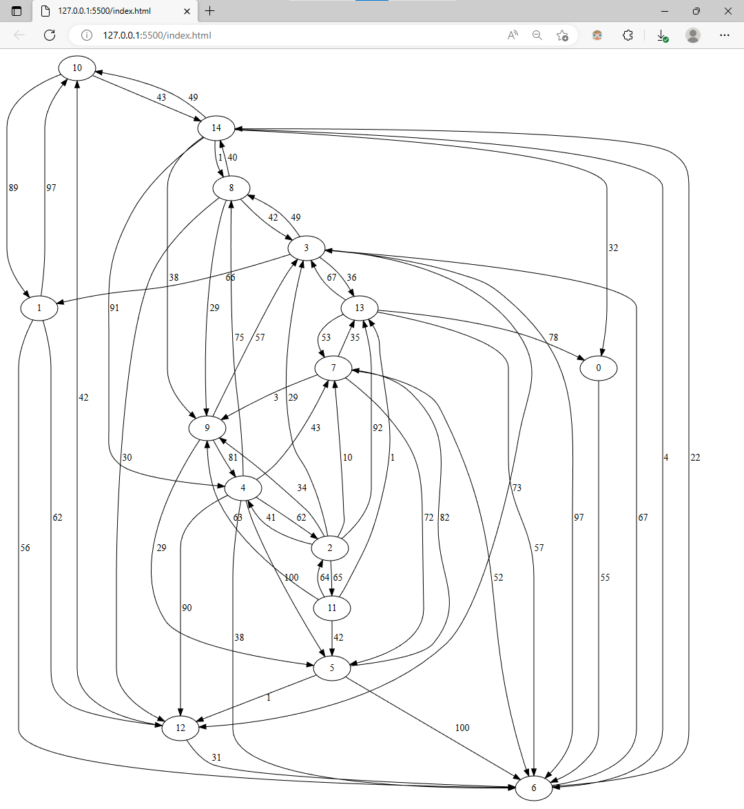
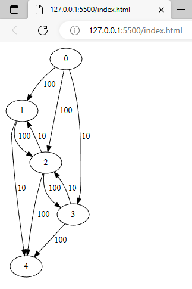

# Dependencies

You need `dot`, `npm` and probably `node` to use this. I haven't tried using this without `node`.

# Input

This tool takes a directed, weighted graph represented as a list of triplets as its input, and "draws" that graph using `dot`.

The triplets should have the format [startNode, endNode, edgeWeight].

# Instructions

1. Run `npm start`.
2. View the contents of `index.html` in your browser to see the graph!
3. Updating `inputGraph.txt` with another valid graph and saving that file should automatically update `index.html`. Depending on which tool you're using to view `index.html`, you may need to refresh your web browser to see the changes.

# Examples

## Larger graph

Contents of `inputGraph.txt`

```
[[10,14,43],[1,12,62],[4,2,62],[14,10,49],[9,5,29],[13,7,53],[4,12,90],[14,9,38],[11,2,64],[2,13,92],[11,5,42],[10,1,89],[14,0,32],[9,4,81],[3,6,97],[7,13,35],[11,9,63],[5,7,82],[13,6,57],[4,5,100],[2,9,34],[11,13,1],[14,8,1],[12,10,42],[2,4,41],[0,6,55],[5,12,1],[13,3,67],[3,13,36],[3,12,73],[7,5,72],[5,6,100],[7,6,52],[4,7,43],[6,3,67],[3,1,66],[8,12,30],[8,3,42],[9,3,57],[12,6,31],[2,7,10],[14,4,91],[2,3,29],[8,9,29],[2,11,65],[3,8,49],[6,14,22],[4,6,38],[13,0,78],[1,10,97],[8,14,40],[7,9,3],[14,6,4],[4,8,75],[1,6,56]]
```

Graph



## Smaller graph

Contents of `inputGraph.txt`

```
[[0,1,100],[0,2,100],[0,3,10],[1,2,100],[1,4,10],[2,1,10],[2,3,100],[2,4,100],[3,2,10],[3,4,100]]
```

Graph


